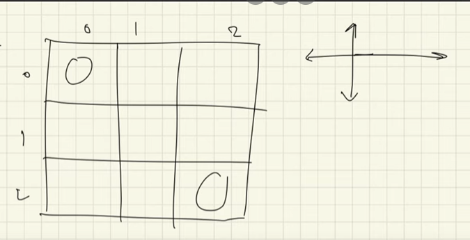
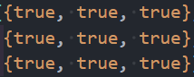
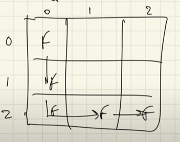

<h3> lets say we have the same maze problem, but we can move in all 4 directions</h3>

- if we attempt to move in all directions, wihtout keeping a track of what cell we have already covered, we would be stuck in a loop
- therefore, we need to keep track of the cells we have covered in our current path to avoid overlapping
- one way for us to this is by marking the cells covered with false

- in this, we change the cells we have already visited to flase so that we can avoid overlapping them
    - but if we mark them as false, for the next path that we will take, the cells will still be marked false and therefore we won't be able to cover those cells in the next path
    - to solve this, we need to reset the cells once we have finished our path

- in this case, we have taken the path shown by the cells marked as false
- to reset the cells, when we exit the function call, we reset the cells to their original state
    - therefore, we reset the cells when we add a 'return' statement as the return statement ends a function call

<h4> this is called backtracking </h4>

- we make some changes when we proceed with the recursion calls, and are undoing the changes when we have finished the recursion calls

- we know if a problem is backtracking based if we face the need to go back and correct one of our answers after we have finished the recursion calls