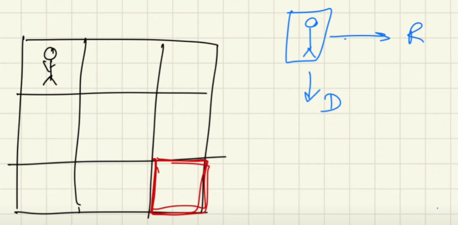

<h4> Given a maze, and a goal point, in how many ways unique ways can you reach the goal?</h4>

this is the maze, and red cell is the goal

<h4> ways to reach the goal </h4>

- right > right > down > down
- down > down > right > right
- right > down > right > down
- right > down > down > right