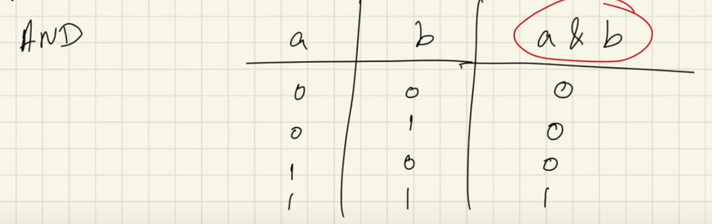
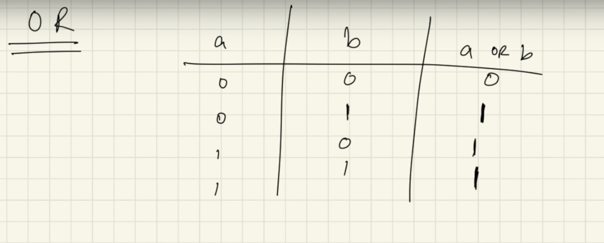
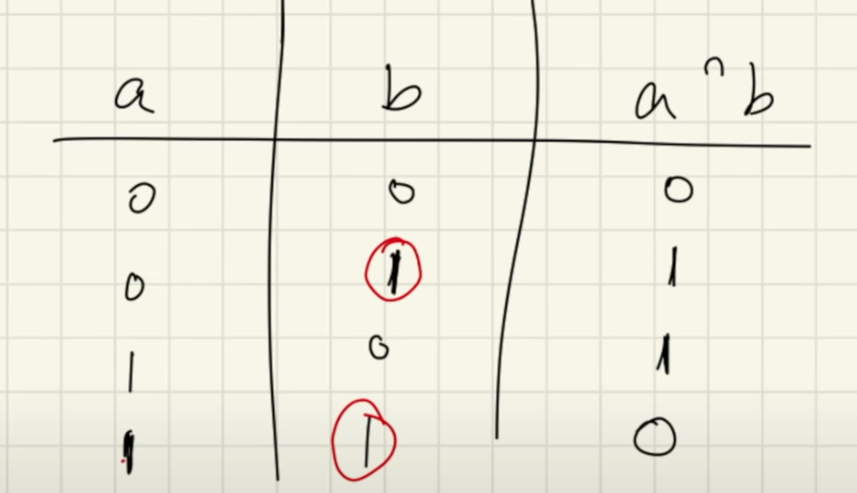
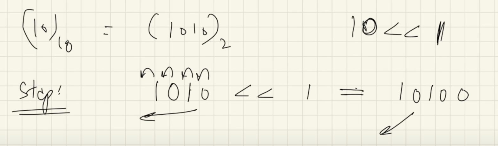
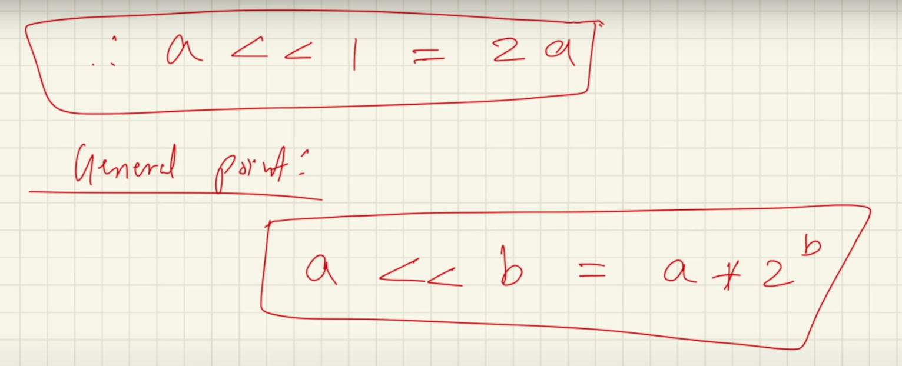
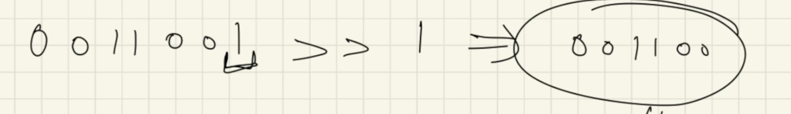
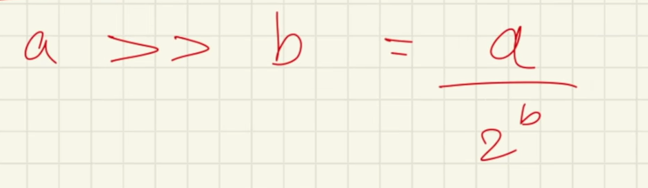

- <h4>AND operator </h4>

- <h4>OR operator </h4>

- <h4>XOR operator (^) </h4>

- <h4>Left shift operator (<<) </h4>

    - shifts the binary digits to the left by one place 
    - for eg: 

    

    - general formula:

    

- <h4>Right shift operator (>>)</h4>

    - shifts the binary digits to the right by one place
    - for eg:

    

    - general formula:

    