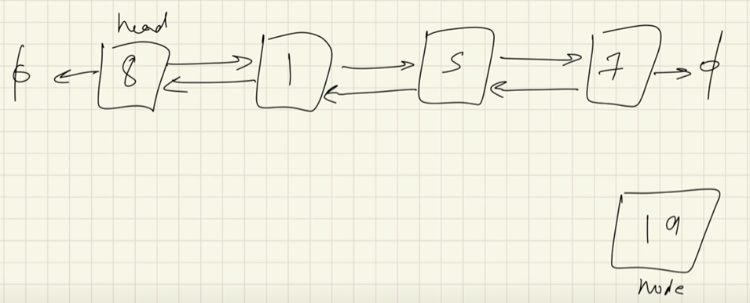
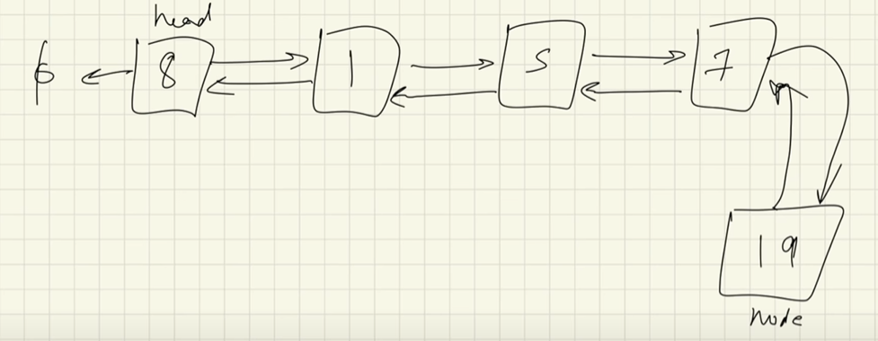

# Adding a new node at the beginning

- create a new node


- ```node.next = head```


- ```node.prev = null```


- ```head.prev = node```


- ```head = node```


# Insertion at the end

- create a new node



- traverse the list till we reach the end (`while last.next != null`)


- `last.next = node`


- `node.prev = last`



- `node.next = null`


# Inserting at any position

- create a new node and traverse to the index you need to insert at


- `newNode.next = prevNode.next`


- `prevNode.next = newNode`


- `newNode.prev = prevNode`


- `newNode.next.prev = newNode`

