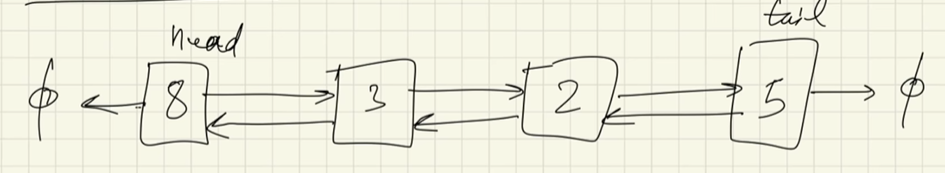
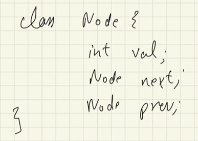

# Doubly Linked List

- same as singly linked list, but each node is pointing to next node and the previous node
- the ```head``` will be pointing to ```head+1``` and ```null```
- the ```tail``` will be pointing to ```null``` and ```tail-1```



- the structure of each node



