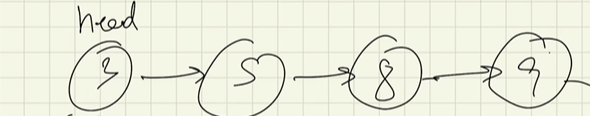
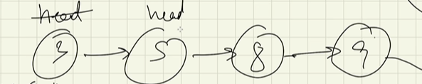
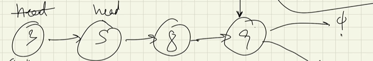
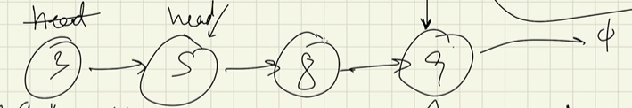
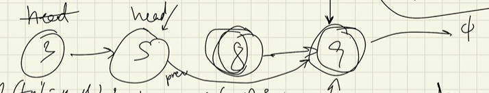

# Deleting the first node

- given that this is our list



- we can delete the first node by pointing the head to the next node after the first node
- this way, the first node is not a part of the list, and hence is deleted from the list
- ```head = head.next```



# Deleting the last node

- we take the same list
- we traverse the list till we reach 'size-2'th node
- we point this second last node to null



# Deleting at any index

- we reach the node at ```index-1```



- we point the ```index-1``` node to ```index+1``` node

