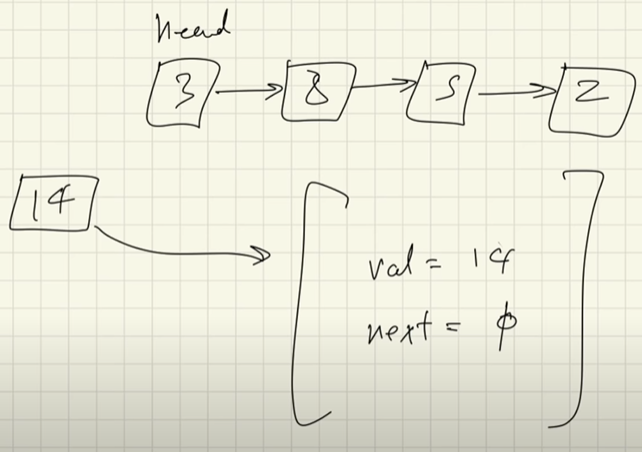
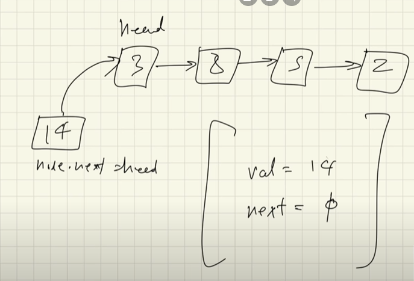
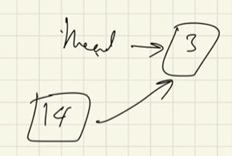
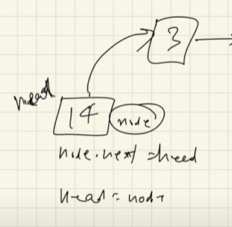
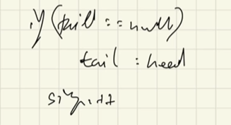
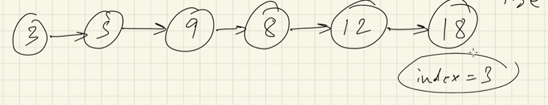
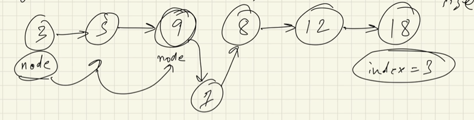
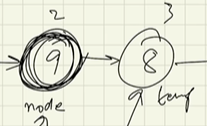
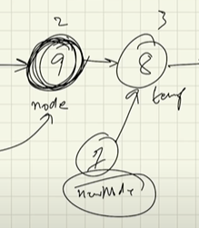
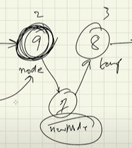

# Inseting into a Linked List at the start

- let's say we have a linked list like given below
- we want to add 14 to the list
- when we add it to the list, the '14' node will have a value as shown below


<br><br>

- now if we want to insert it at the beginning of the list, it would look something like this



- both head and '14' node will be poiting to '3' node



- since we are inserting '14' node at the first position, that means that the head node will also be updated



<h4>*note: </h4> 

- if we are inserting into an empty linked list, then the head and the tail nodes will be the same


<br><br>

- time complexity for insertion at start is O(1) (since we already have beginning)
- for insertion at end
    - if we have tail, it is O(1) (since we have tail)
    - if no tail, it is O(n) (since we go through the list one by one to find the last element)

# Inserting into a Linked List at any index

- lets say we have a list like given below




- we want to insert something like this



- to do this, we proceed as follows
- we first reach the node that is just before the index node



- this is our current list
- with ```Node node = new Node(val, temp.next);```, we create a new node and point to the node at our index



- now since our new node is already pointing to the index node, we erase the index-1 node from pointing to the index node and make it point to the new node with ```temp.next = node;```


