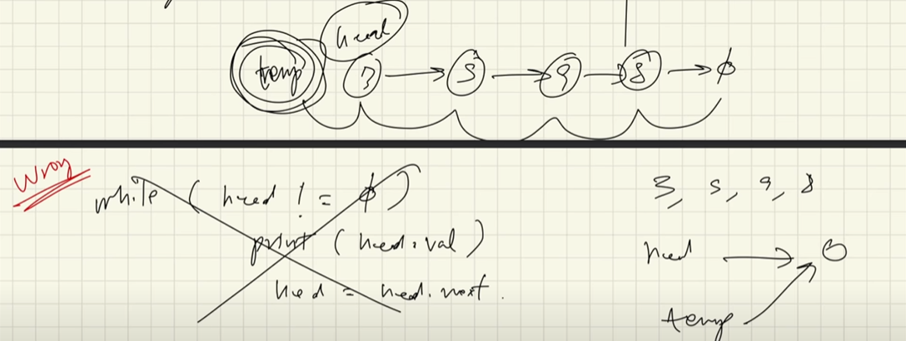

# Printing a Linked List

- if we want to print a Linked List, we take the head to print the list
- we can run a loop that prints all the nodes in the list while head is != null
- to traverse the list, we point the head to the next node, and as soon as the head reaches the end, it will be null
    - but if we use the original head to keep updating the values, then the structure of the linked list will be altered
    - therefore, we take a temp variale, assign head to it, and update the temp
    - this way, the structure of the linked list remains intact, and we can traverse the list

- here temp is not a part of the structure of the linked list, hence we are free to manipulate it
