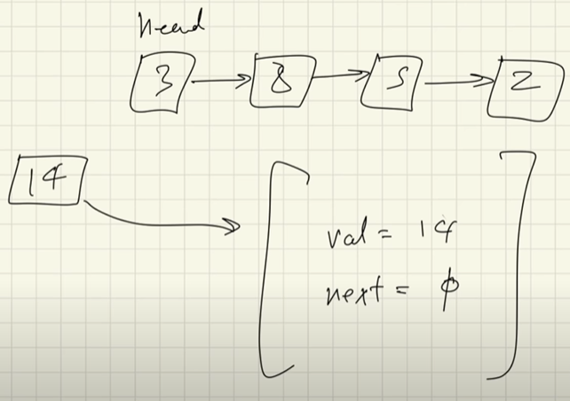
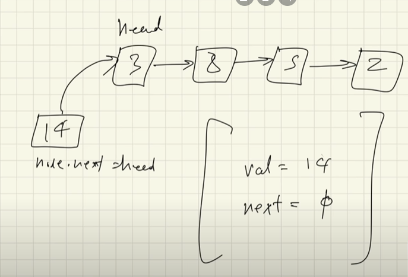
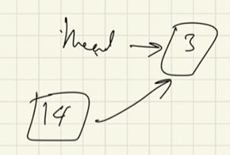
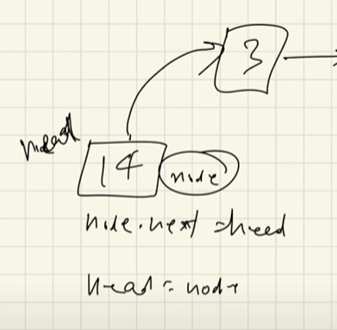
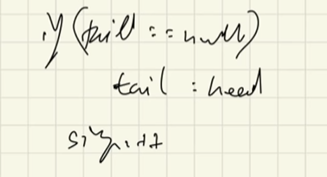

# Inseting into a Linked List

- let's say we have a linked list like given below
- we want to add 14 to the list
- when we add it to the list, the '14' node will have a value as shown below

  

- now if we want to insert it at the beginning of the list, it would look something like this

- both head and '14' node will be poiting to '3' node

- since we are inserting '14' node at the first position, that means that the head node will also be updated

<h4>*note: </h4> 

- if we are inserting into an empty linked list, then the head and the tail nodes will be the same

