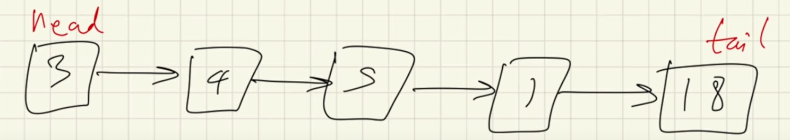
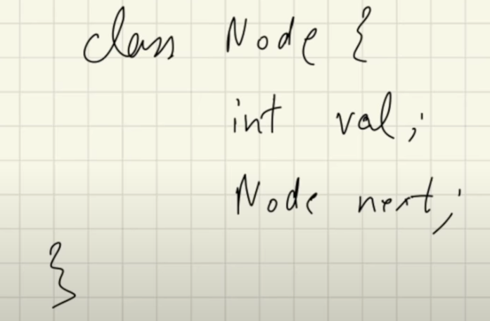

# Linked Lists

- each block in a linked list is called a node

<h3> Single Linked List </h3>

- each cell is a node in the above list
- head is the first node
- tail is the last node
- each node is pointing to only one node, i.e. the next node

<h4> Representation of each node</h4>

- each node only knows its value, and the node it is pointing to

- to get a value at a certain index
    - we run a for loop for 'n' times (n = index)
    - the node being pointed to at end of n iterations is our value