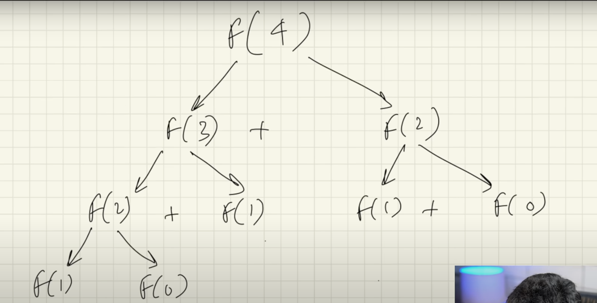

<h2>How to solve recursion problems</h2>

we are trying to solve fibonacci problem
- build a recursion tree

  

- write a reccurence formula

  

- base condtion is represented by answers already provided