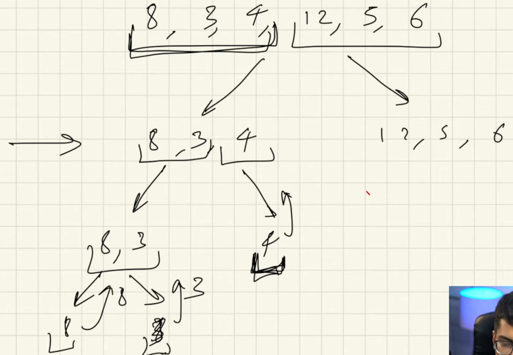
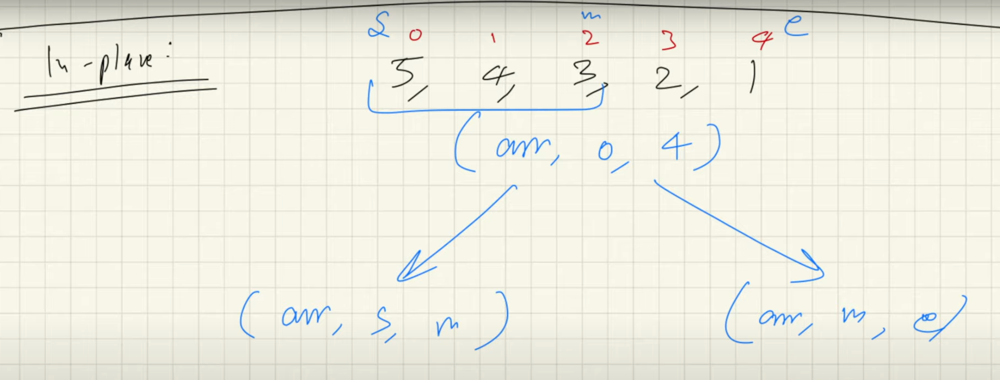

# Merge Sort

- divides the array into two halves, sorts the array adn merges the arrays

<h4> steps </h4>

- divide the array into two parts
- get both parts sorted by recursion
- merge the sorted parts

# in-place merge sort
