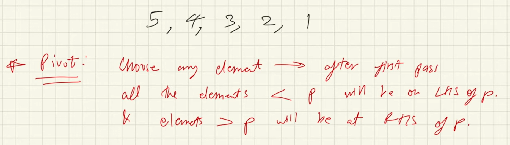
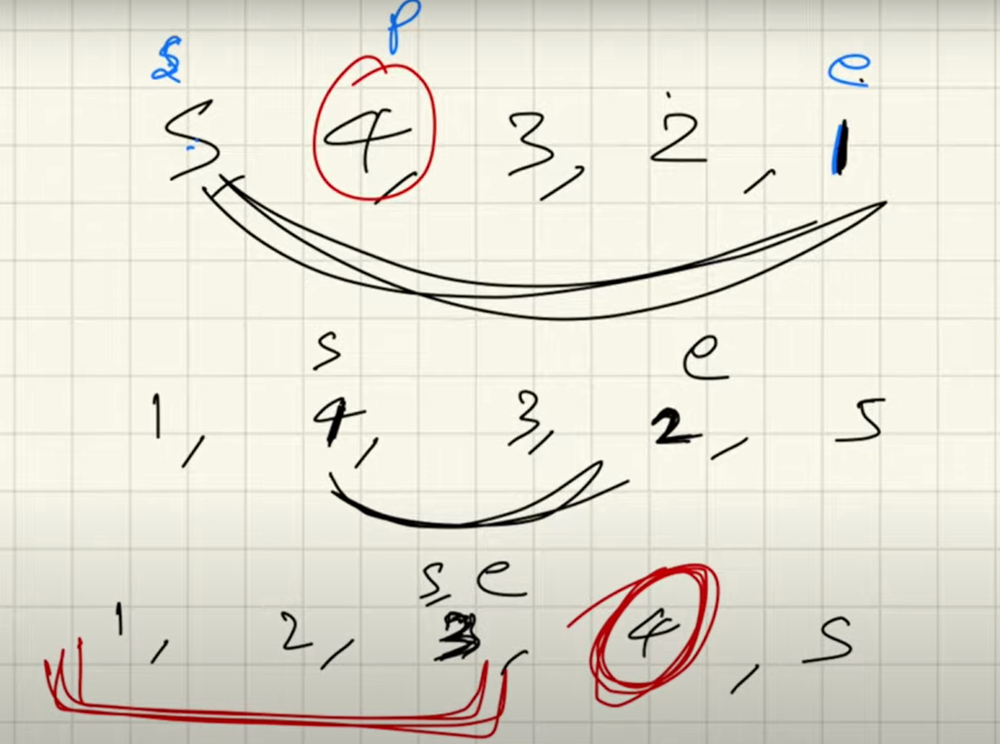
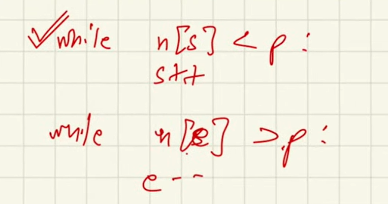
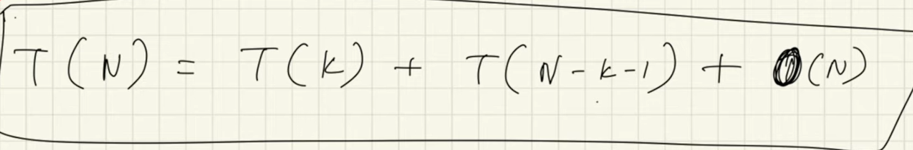

# Quick Sort

- we begin by taking a pivot
- pivot can be any element in the array
- after we take the pivot, 
    - all elements less than it are on LHS
    - all elements greater than it are on RHS

- after we take the pivot, we take 2 pointers, start and end
- we check if(start > pivot)
    - if yes, we swap with end
- we check if(end < pivot)
    - if yes, we swap with start
- we keep doing this while start < end or pivot is at correct position

- after pivot has been sorted, we pass a recursion call for the LHS and RHS arrays
    - LHS - (low, end)
    - RHS - (start, high)
    - low and high tells which part of array we are working on

<h4> Recurence Relation</h4>

<h4>how to pick the pivot</h4>

- you can pick random
- you can pick corner elements 
- you can pick middle element