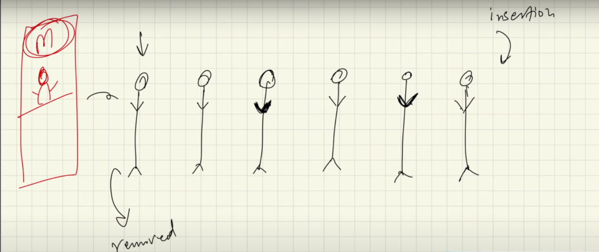

# Queues

- First in First out || Last in Last out

- Works on the principle of a linked list
- Since insertion happens from the back, and deletion from the front
    - We assign the first element as the head, and to remove an element from the queue, we move the head pointer by 1
- uses a head and a tail internally so that insertion becomes easier and we don't have to traverse entire list to add a new element