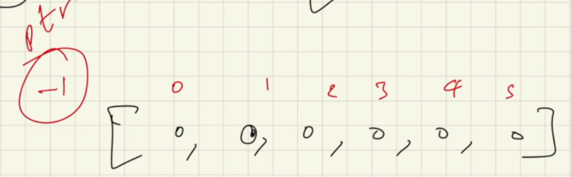
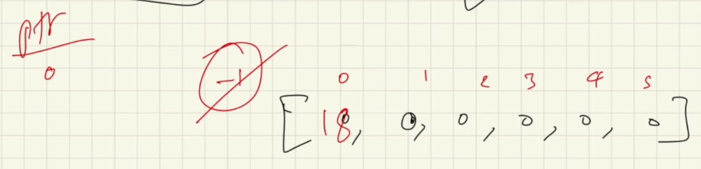
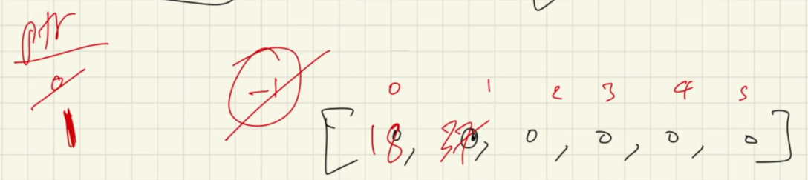
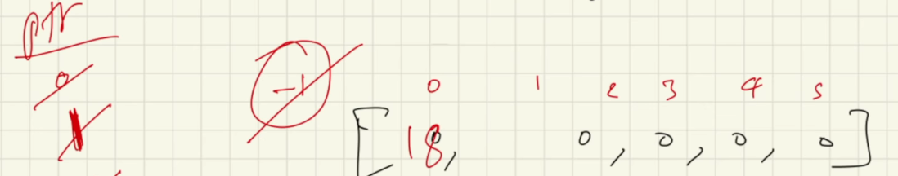

# Stacks

- First in Last out || Last in First ouy
- Push -  add an item to the stack
- Pop - remove an item from the stack

- Internally, it works with an array 
- Time Complexity in insertion & deletion = O(1) (Constant since we are using array)

<h2> To make the working of a stack </h2>

- initialize an array and maintain a pointer

- inserting an item
    - increase index by 1, insert item in current index 

- removing an item 
    - remove item from current index, then decrement index

