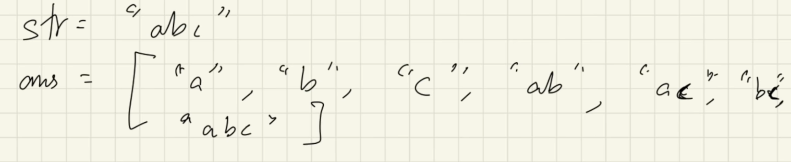
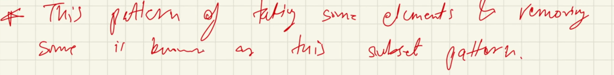
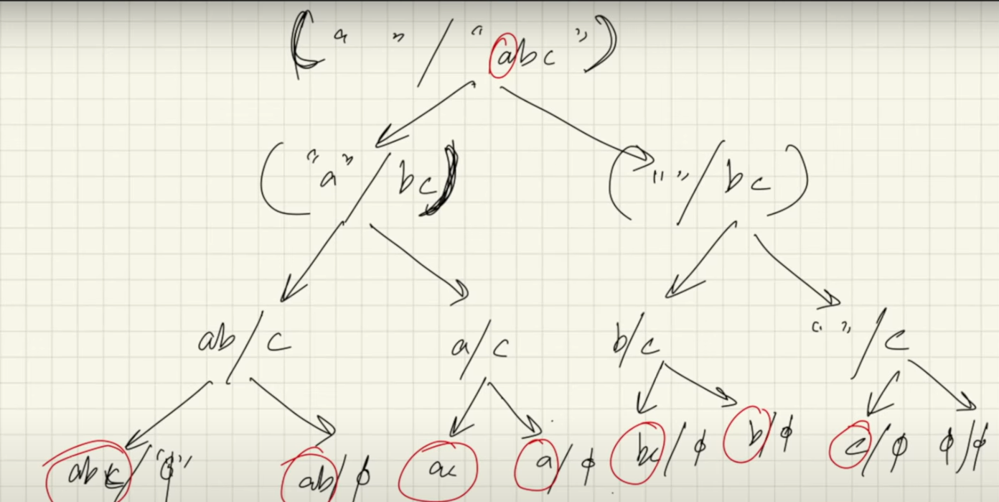

# Subsets

<h4> What are subsets? </h4>

- all possible combination of elements in a string or array

<h4> How to solve subset problems </h4>

- we take some elements from the main string and remove some elements
- this forms a subset 

<h4> Recursion tree </h4>

- at every recursion call, we decide to take an element and not take an element
- once the recursion reaches an empty substring, we have found all the substrings possible in that branch