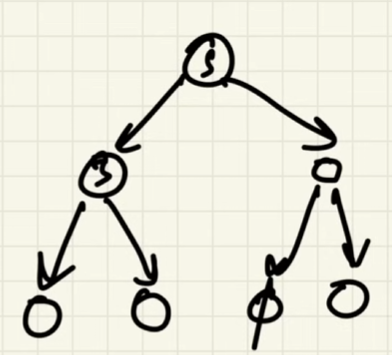
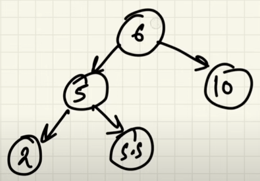
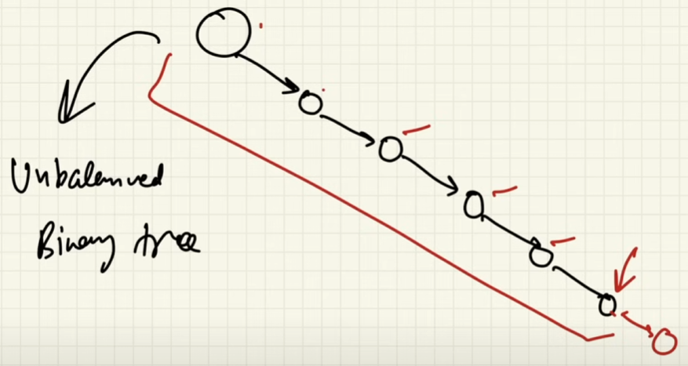
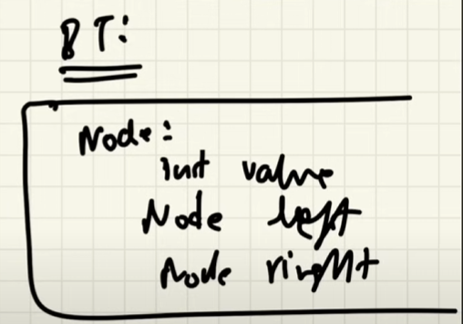
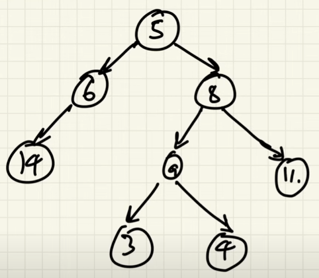
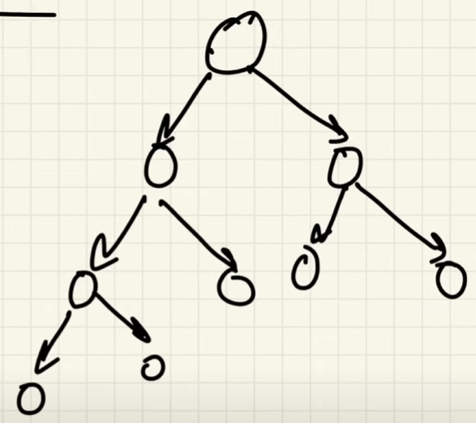
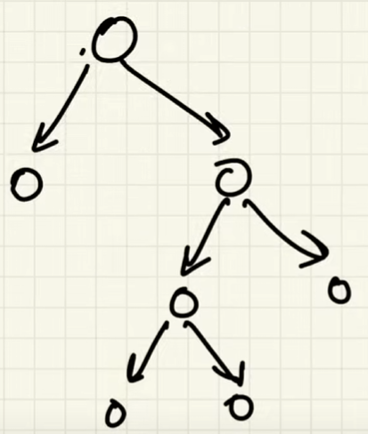
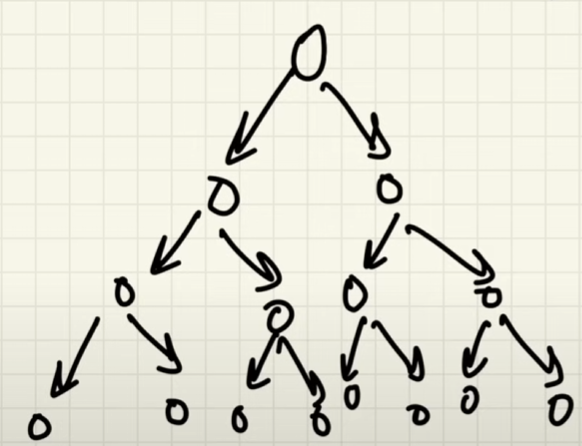
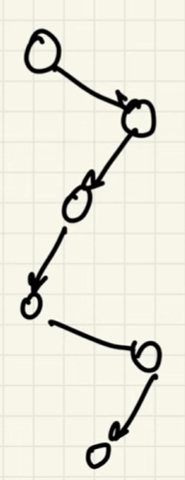

# Trees

- Each node is connected to 2 other nodes (can also be connected to a null node too)

# Why Trees?

- Insert, remove and search for elements in O(log N) time
- Elements are ordered (Binary Search Tree)
- In binary tree, for a particular node, all the elements to the left are smaller, and all the elements are larger
- Example: 

# Limitation

- If the tree has elements only to one side, its an unbalanced binary tree

- To solve this, we use self balancing binary trees (AVL is an example)

# Uses

- Databases
- Network Routing
- Decision Trees
- Huffmann Coding (Compression of files)
- Heaps, Graphs (DS)

# Node Structure

- Structured similar to Linked Lists nodes
- Has 3 main elements:
    - int value (Value of the node)
    - Node left (Points to the left node)
    - Node right (Points to the right node)

    

# Properties

- Size = Total no of nodes
- Parent node - node which is connected to 2 further nodes 
    - (8 is parent of 9 & 11)
- Child node - nodes that are connected to a parent node 
    - (3 is child of 9)
- Siblings - any 2 nodes that have the same parent 
    - (3 & 4 are siblings)
- Edge - line connecting 2 nodes
- Height - max no of edges b/w a node and leaf node
    - (height of 5 = 3, for 8 = 2)
- Leaf nodes = bottommost nodes
- Root node = Node with no parent node (starting node of a tree)
- Level = difference of height between a node and root node
- Ancestor and Descendant = relation of nodes connected by a path
    - taking 8, 9, 11 - 8 is an ancestor of 11, 11 descendant of 8

# Types of Binary Trees

- Complete Binary Tree
    -
    - All the levels are filled except for the last level
    - last level is full from left to right

    

- Full Binary Tree/Strict Binary Tree
    -
    - node has either 0 children or 2 children

    

- Perfect Binary Tree
    -
    - all the internal nodes have 2 children
    - all levels are full

    

- Height Balanced Binary Tree
    -
    - avg height = O(log N)

- Skewed binary tree
    -
    - Every node has only one child
    - Similar to Linked list
    - O(log N)

    

- Ordered Binary Tree
    -
    - Every node has a property
    - eg. Binary Search Tree

# Tips to solve questions

- In perfect BT, if height = h 
    - total nodes = 2(h+1) - 1
    - total leaf nodes = 2h
    - total internal nodes = 2h - 1